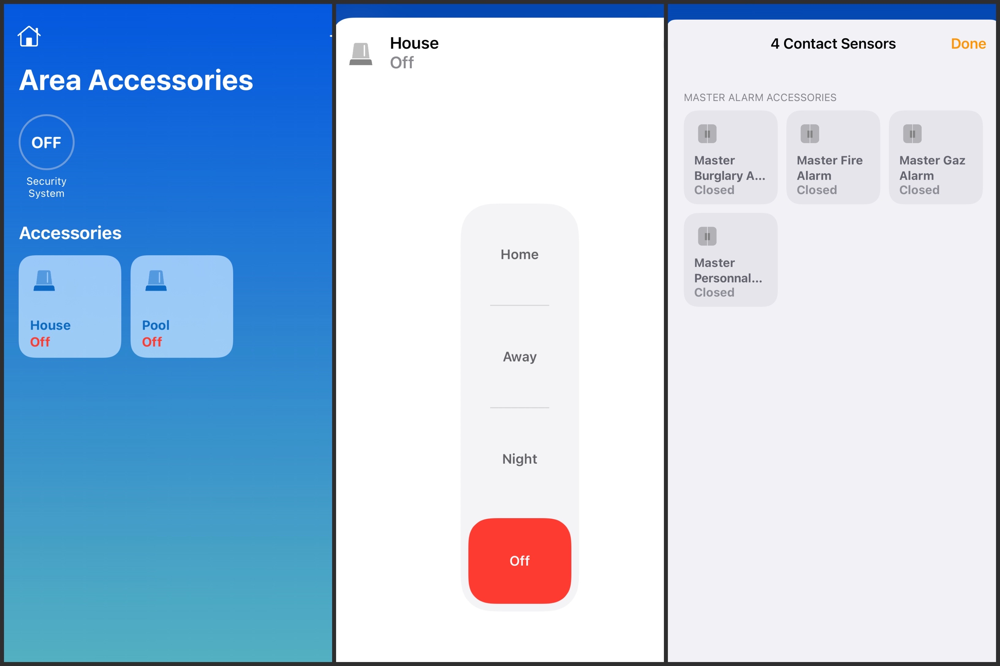
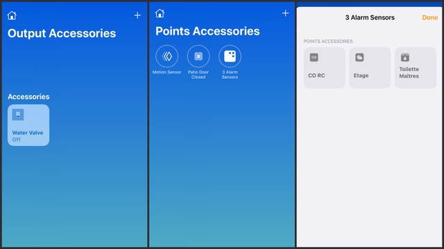

# Homebridge Plugin for Bosch B and G Control Panels

This Homebridge plugin allows interactions with your Bosch Control Panel

* Set Control Panel Area arming mode (Arm, Disarm, Part on instant, Part on delay)
* Set Control Panel Outputs states (On, Off)
* Use Control Panel Points states for home automation purposes (Motion, Contact, Smoke, Leak and Carbon Monoxide)
* Get Control Panel Master Alarm notifications for Fire, Burglary, Gaz and Personnal events. 

## Supported Bosch Control Panels

* [Bosch B Series Control Panels](https://resources-boschsecurity-cdn.azureedge.net/public/documents/B_Series_Quick_Selec_Commercial_Brochure_enUS_23341998603.pdf)
* [Bosch G Series Control Panels](https://resources-boschsecurity-cdn.azureedge.net/public/documents/Bosch_G_Series_Quick_Commercial_Brochure_enUS_23390517387.pdf)

## Bosch Control Panel Configuration

### Easy method
Contact your Bosch Control Panel installer. The following required configuration options can be remotely applied to your panel.

### Hard method
* Connect to your Bosch Control Panel with [RPS Software](https://www2.boschsecurity.us/bseriesinstall/programming).
* Initial connection to your Bosch Control Panel with RPS through network requires a RPS passcode. RPS passcode should be provided with your hardware. If RPS Passcode is not avaiblable, connection to the panel can be established with a direct USB cable. 

### Required Control Panel RPS configurations options
* Control Panel needs to be connected to your home network through on board ethernet adapter. Note Control Panel IP address on your router or network logs. 
* In AUTOMATION - REMOTE APP menu, set "Automation Device" to "Mode 2" 
* In AUTOMATION - REMOTE APP menu, set an "Automation passcode" 
* In PANEL WIDE PARAMETERS - ON BOARD ETHERNET COMMUNICATOR menu, note TCP/UDP PORT NUMBER (defaults to 7700) 
* USE RPS to install the latest Control Panel firmware update. Older firmware may be limited to TLS 1.0 wich prevent Homebridge from establishing a secure connection.
* This plugin supports Intrusion Integration Protocol Version 5.208 and newer (to get event driven notifications) 

## Homebride pluging configuration file
Please see sample config file [config.sample.json](config.sample.json)
### General parameters
* `Name` : Plugin name
* `Host`:  Bosch Control Panel IP address
* `Port`:  Bosch Control Panel Port number (defaults to 7700)
* `Automation passcode`: Value as configured on your Bosch Control Panel (See required configurations options)
### Master Alarms Sensors
If selected, Contact Sensors will be added in Home App and report panel wide Fire, Gaz, Burglary or Personnal alarms.
* `MasterFireAlarm`: Report panel wide Fire alarms
* `MasterGazAlarm`: Report panel wide Gaz alarms
* `MasterBurglaryAlarm`: Report panel wide Burglary alarms
* `MasterPersonnalAlarm`: Report panel wide Personnal alarms
### Log File Configuration
*
*
*
*

### Areas (Only add areas to be monitored by Homebridge in config file)
* `Number`: Area number on the Control Panel to be monitored by the plugin
* `"Area(s) in Scope`:
* `Passcode Follows Scope`:
* `Show Accessory in Home App`: Show Security System Accessory in Home App to change this area arming mode
### Points - Control Panel Sensors (Only add points to be monitored by Homebridge in config file)
* `Number`: Point (Sensor) number on the Control Panel to be monitored by the pluggin. When first run in debug mode, the plugin will list all sensors available for configuration.
* `Show Accessory in Home App`: Show Sensor Accessory in Home App for automation purposes. 
* `Sensor Type`: Motion Sensor, Contact Sensor, Leak Sensor, CO Sensor or Smoke Sensor
### Outputs (Only add outputs to be monitored by Homebridge in config file)
* `Number`: Output number on the Control Panel to be monitored by the pluggin. When first run in debug mode, the plugin will list all outputs available for configuration.
* `Show Accessory in Home App`: Show Output Accessory in Home App. 

## Operation
### Security System Accessory:
The following conversions are applied between Homekit Area Arming state and Bosch Control Panel Area Arming state: 

| Homekit Area Arming State | Bosch Area Arming State|
| ------ | ------ | 
| Off | Disarmed
| Away | All On Delay
| Night | Part On Instant
| Home | Part On Delay

# Releases
## 0.3.0
* Adding Master Fire Alarm Sensor, Master Gaz Alarm Sensor, Master Burglary Alarm Sensor and Master Personnal Alarm Sensor: If selected, Contact Sensors will be added in Home App to monitor Fire, Gaz, Burglary or Personnal Alarms. Each sensor will trigger only if an alarm state for the event it is monitoring is detected on any Area configured on the Bosch Control Panel

## 0.2.1
* No changes in configuration file. 
* Commands sent to controller are now queued. This prevents a race condition where 2 commands would not be executed properly if called simultaneously.
* More usefull information when run in Debug mode (-D)
* Fix on Triggered Alarm management and return to normal state once alarm is cleared

## 0.1.0
* Accessories universally unique identifier had to be changed. Some accessory automation may have to be reconfigured after upgrading plugin to version 0.1.0
* Adding panel output support to plugin.
* Adding plugin automatic reconnection to control panel in case of connection timeout or connection lost. 
* Adding Homekit unique serial number for accessory. Issue was causing errors in some 3rd party Homekit app. 

# Disclaimer
This is Beta software. Not to be relied upon for life or mission critical applications.

