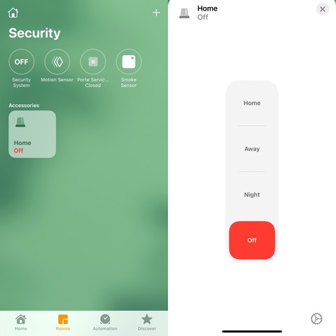

# Homebridge Plugin for Bosch B and G Control Panels

This Homebridge platform plugin allows you to:

* Control your Bosch Security System state (Arm, Disarm, Part on instant, Part on delay)
* Use your control panel sensors for home automation purposes

## Supported Control Panels

* [Bosch B Series Control Panels](https://resources-boschsecurity-cdn.azureedge.net/public/documents/B_Series_Quick_Selec_Commercial_Brochure_enUS_23341998603.pdf)
* [Bosch G Series Control Panels](https://resources-boschsecurity-cdn.azureedge.net/public/documents/Bosch_G_Series_Quick_Commercial_Brochure_enUS_23390517387.pdf)

## Bosch Control Panel Configuration

### Easy method
Contact your Bosch Control Panel installer. The following required configuration options can be remotely applied to your panel.

### Hard method
* Connect to your Bosch Control Panel with [RPS Software](https://www2.boschsecurity.us/bseriesinstall/programming).
* Initial connection to your Bosch Control Panel through ethernet requires a RPS Passcode. If RPS Passcode is not avaiblable, connection to the panel can be established with a direct USB cable. 

### Required control panel configurations options
* In AUTOMATION - REMOTE APP menu, set "Automation Device" to "Mode 2" 
* In AUTOMATION - REMOTE APP menu, set an "Automation passcode" 
* In PANEL WIDE PARAMETERS - ON BOARD ETHERNET COMMUNICATOR menu, note TCP/UDP PORT NUMBER (default to 7700) 
* Install the latest Control Panel firmware update. Older firmware may be limited to TLS 1.0 wich prevent homebridge from establishing a connection.
* This plugin supports Intrusion Integration Protocol Version 5.208 and newer (to get event driven notifications) 

## Homebride pluging configuration file

### General parameters
* `Name` : Plugin name
* `Host`: IP address of your Bosch Control Panel
* `Port`: Port number of your Bosch Control Panel (default to 7700)
* `Automation passcode`: Value as configured on your Bosch Control Panel (See required configurations options)
### Areas parameters (Only add areas to be monitored in config file)
* `Number`: Area number on the Control Panel to be monitored by the plugin
* `Show Accessory in Home App`: Show Security System Accessory in Home App to change this area state
* `Custom Area Text`: Any value entered here will override the Area text configured on your Control Panel. Custom text is only applied to Homebridge and Homme App. This plugin doesn't modify any data directly on the Control Panel.
### Points - Control Panel Sensor parameters (Only add points to be monitored in config file)
* `Number`: Point (Sensor) number on the Control Panel to be monitored by the pluggin. When first run in debug mode, the plugin will list all available sensors for configuration.
* `Show Accessory in Home App`: Show Sensor Accessory in Home App for automation purposes. 
* `Custom Point Text`: Any value entered here will override the Point text configured on your Control Panel. Custom text is only applied to Homebridge and Homme App. This plugin doesn't modify any data directly on the Control Panel.
* `Sensor Type`: Motion Sensor, Contact Sensor, Leak Sensor, CO Sensor or Smoke Sensor

## Operation

### Securiity System Accessory:
The following conversions are applied between Homemit Area Arming state and Bosch Control Panel Area Arming state: 

| Homekit Arming State | Bosch Arming State|
| ------ | ------ | 
| Off | Disarmed
| Away | All On Delay
| Night | Part On Instant
| Home | Part On Delay

# Disclaimer
This is Beta software. Not to be relied upon for life or mission critical applications.

