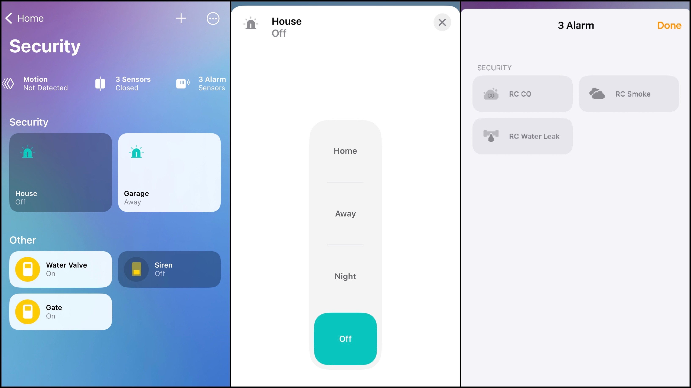

# Homebridge Plugin for Bosch Control Panels

This Homebridge plugin allows interactions with your Bosch Control Panel supporting Mode 2 integration.

* Set Panel Area arming mode (Arm, Disarm, Part on instant, Part on delay)
* Set Panel Outputs state (On, Off)
* Use Panel Points state for home automation purposes (Motion, Contact, Smoke, Leak and Carbon Monoxide)
* Get Panel Wide notifiations for Fire, Burglary, Gaz and Personnal events. 

## Supported Bosch Control Panels
| Bosch Panel  | Status | Notes |
| ------ | ------ |  ------ |
| [B Series](https://resources-boschsecurity-cdn.azureedge.net/public/documents/B_Series_Quick_Selec_Commercial_Brochure_enUS_23341998603.pdf) |Supported|  |
| [G Series](https://resources-boschsecurity-cdn.azureedge.net/public/documents/Bosch_G_Series_Quick_Commercial_Brochure_enUS_23390517387.pdf) |Supported |  |
| [GV4](https://resources-boschsecurity-cdn.azureedge.net/public/documents/Bosch_G_Series_Quick_Commercial_Brochure_enUS_23390517387.pdf) |Status Pending | Firmware 2.00 and higher |
| [Solution 2000/3000](https://media.boschsecurity.com/fs/media/pb/images/products/intrusion_alarm/solution_2000___3000/Solution-2000-3000-Brochure-2021.pdf) | Supported | Data pooling for firmware <= 2.1 |
| [AMAX Series](https://resources-boschsecurity-cdn.azureedge.net/public/documents/AMAX_panel_family_Installation_Manual_frFR_15867163019.pdf) | Status Pending| Firmware 4.01 and higher |

## Bosch Control Panel Configuration
- [B Series, G Series and GV4 Panels](https://github.com/EHylands/homebridge-boschcontrolpanel_bgseries/blob/master/README_US.md)
- [Solution 2000/3000 Panels](https://github.com/EHylands/homebridge-boschcontrolpanel_bgseries/blob/master/README_AU.md)

## Homebride pluging configuration file
### General parameters
* `Host`:  Bosch Control Panel IP address
* `Port`:  Bosch Control Panel Port number (defaults to 7700)
* `Passcode`: Value as configured on your Bosch Control Panel (Automation Passcode on B, G , GV4 Panels, User Passcode on Solution 2000/3000 and AMAX Panels).
* `Legacy Mode`: Force plugin to use first generation protocol and data pooling.
### Areas (Only add areas to be monitored by Homebridge)
* `Number`: Area number on the Control Panel to be monitored by the plugin
* `Area(s) in Scope`: Comma separated list of other Areas on your Control Panel to be monitored by this accessory. If an alarm is triggered in one of those Area, your accessory will trigger (Default value: Empty string)
* `Passcode Follows Scope`: If selected, Arming and Disarming your accessory will also Arm or Disarm all other Areas in Scope (Default value: not selected)
* `Show Accessory in Home App`: Show Security System Accessory in Home App
### Points - Control Panel Sensors (Only add points to be monitored by Homebridge)
* `Number`: Point (Sensor) number on the Control Panel to be monitored by the pluggin
* `Sensor Type`: Motion Sensor, Contact Sensor, Leak Sensor, CO Sensor or Smoke Sensor
* `Show Accessory in Home App`: Show Sensor Accessory in Home App 
### Outputs (Only add outputs to be monitored by Homebridge)
* `Number`: Output number on the Control Panel to be monitored by the pluggin
* `Show Accessory in Home App`: Show Output Accessory in Home App
### Master Alarms Sensors
If selected, Contact Sensors will be added in Home App and report panel wide Fire, Gaz, Burglary or Personnal alarms.
* `MasterFireAlarm`: Report panel wide Fire alarms
* `MasterGazAlarm`: Report panel wide Gaz alarms
* `MasterBurglaryAlarm`: Report panel wide Burglary alarms
* `MasterPersonnalAlarm`: Report panel wide Personnal alarms
### Log File Configuration
* `Panel Confidence Message Notifications`: Show control panel keep alive notifications in log file
* `Points Notifications`: Show sensors state changes in log file
* `Output Notifications`: Show outputs state changes in log file
* `Area Alarm Notifications`: Show Areas Alarms in log file
* `Area Arming Status Notifications`: Show Areas Arming status in log file

## Operation
### Legacy Mode:
Whit this option enabled, the plugin will only use first generation protocol to exchange data with the panel.
* Expect longer plugin start time 
* Plugin will pool the panel rather then use push notifications (subscriptions)
* Any event occuring for a very short amount of time on the panel may not be detected by the plugin in this mode (Sensor only triggering for 1 second, Output automaticaly changing state after 1 second)

### Security System Accessory:
The following conversions are applied between Homekit Area Arming state and Bosch Control Panel Area Arming state: 

| Homekit Area Arming State | Bosch Area Arming State|
| ------ | ------ | 
| Off | Disarmed
| Away | All On Delay
| Night | Part On Instant
| Home | Part On Delay

